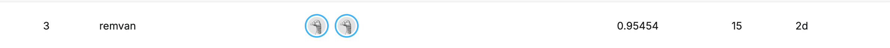

## Training

To train the model with the same settings as in the Kaggle competition:

```bash
python3 main.py \
  --backbone vit_so400m_patch14_siglip_378.v2_webli \
  --use_routing \
  --image_size 378 \
  --use_mixup \
  --epochs 20 \
  --seed 1666 \
  --batch_size 64
```

Optionally, set the number of workers with `--num_workers <int>`.

## Evaluation

Once training is complete, run the following to get predictions on the test set:

```bash
python3 gather_test_preds.py \
  --output res_router.csv \
  --path Experiments/1666/vit_so400m_patch14_siglip_378.v2_webli_batch_size:64_img_size:378_mixup_routing
```

## Pretrained Weights

Single-fold weights are available for download [here](https://drive.google.com/file/d/1inQDS0OJAtrXXVqMCtXYL9DOrSH3xZho/view?usp=sharing).

After downloading, place the weights in `dir/<weights>` so the test prediction script can locate them.

At the time of submission we are in 3rd place


Our report can be found in this repo at [final_report.pdf](final_report.pdf)
